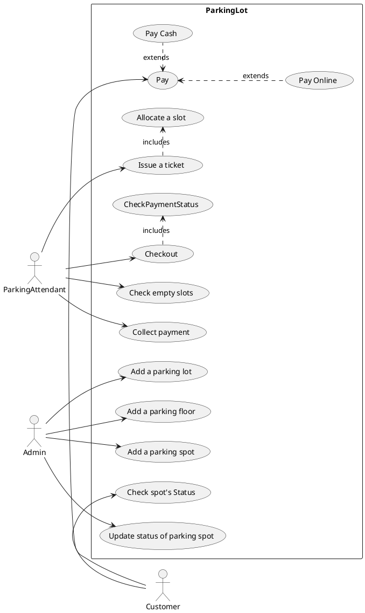

### Requirements

1. Multiple floors

### Use Case diagram

```plantuml
@startuml
left to right direction
actor ParkingAttendant
actor Customer
actor Admin

rectangle ParkingLot {
   Admin --> (Add a parking lot)
   Admin --> (Add a parking floor)
   Admin --> (Add a parking spot)
   Admin --> (Update status of parking spot)
   
   usecase "Pay" as Pay
   usecase "Pay Online" as PayOnline
   usecase "Pay Cash" as PayCash
   usecase "Allocate a slot" as AllocateSlot
   usecase "Issue a ticket" as IssueTicket
   usecase "Checkout" as Checkout
   
   Customer ->(Pay)
   Customer ->(Check spot's Status)
   
   ParkingAttendant --> (Check empty slots)
   ParkingAttendant --> IssueTicket
   ParkingAttendant --> (Collect payment)
   ParkingAttendant --> (Checkout)
   
   Pay <.. (PayOnline) : extends
   Pay <. (PayCash) : extends
   
   IssueTicket .> (AllocateSlot) : includes
   Checkout .> (CheckPaymentStatus) : includes
   
}
@enduml
```