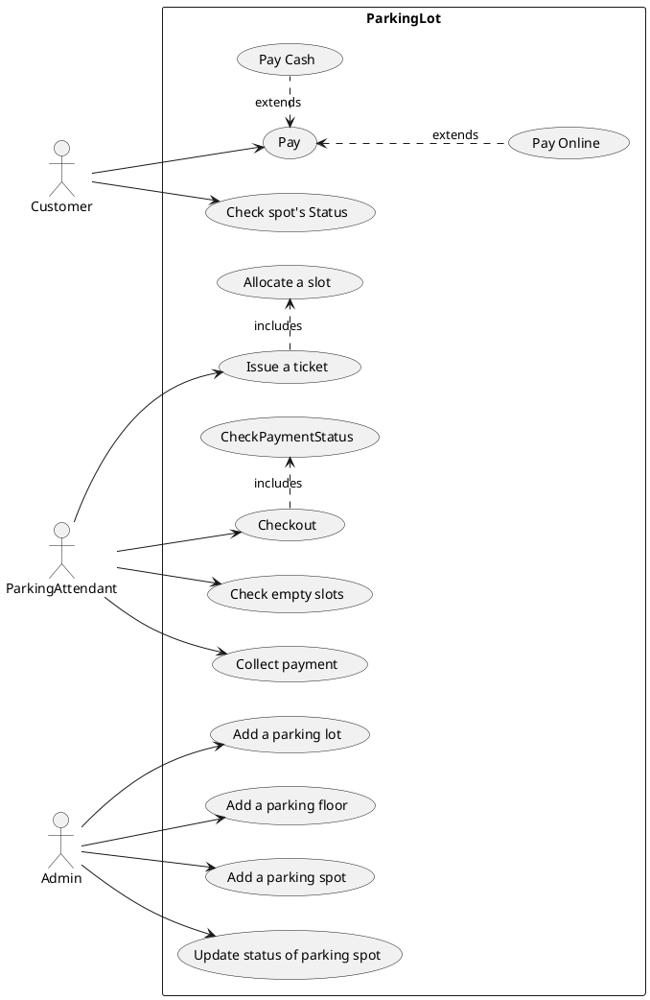
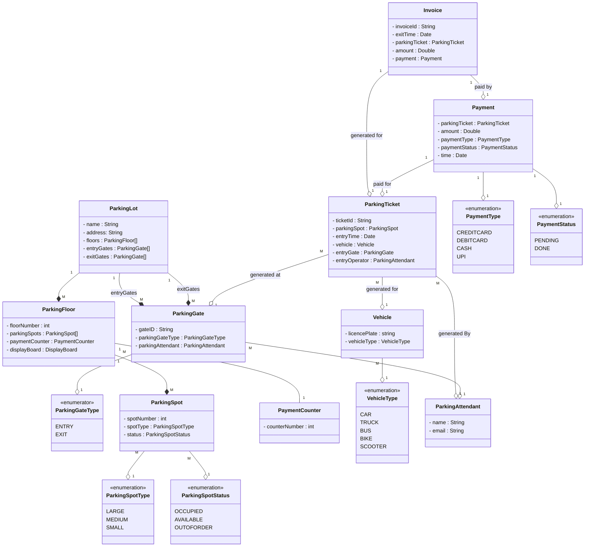
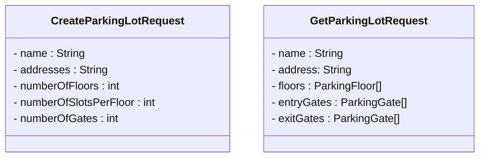

### Requirements

1. Multiple floors
2. Each floor will have multiple slots
3. Slot types : Large, Medium, Small
4. Vehicle can only be parked at its own slot type
5. Multiple entry and exit gates
6. Each entry gate will have a display board
7. For entering operator will provide a ticket
8. For payment calculation can be done based on slot type and duration (First hour : X, subsequent hours : Y)
9. Modes of payment: CC, DC, Cash, Online(UPI, Net-banking)
10. Manual Payment Counter at every floor
11. Display board shows empty slots at every floor

## Kanmay's Requirements
Build an online parking lot management system that can support the following requirements:
* Should have multiple floors.
* Multiple entries and exit points.
* A person has to collect a ticket at entry and pay at or before exit.
* Pay at:
    * Exit counter (Cash to the parking attendant)
    * Dedicated automated booth on each floor
    * Online
* Pay via:
    * Cash
    * Credit Card
    * UPI
* Allow entry for a vehicle if a slot is available for it. Show on the display at entry if a slot is not available.
* Parking Spots of 3 types:
    * Large
    * Medium
    * Small
* A car can only be parked at its slot. Not on any other (even larger).
* A display on each floor with the status of that floor.
* Fees calculated based on per hour price: e.g. 50 rs for the first hour, then 80 rs per extra hour.
    * Small - 50, 80
    * Medium - 80, 100
    * Large - 100, 120

### Use Case diagram

### Class diagram

### API Design

Pattern to follow : `API name` - `HTTP method` - `URL` - `?Request body` - `?Response body`

#### Parking Lot (CRUD)
1. Create a parking lot : `POST` - `/parking-lot` - `CreateParkingLotDTO` - `GetParkingLotResponse`

2. 