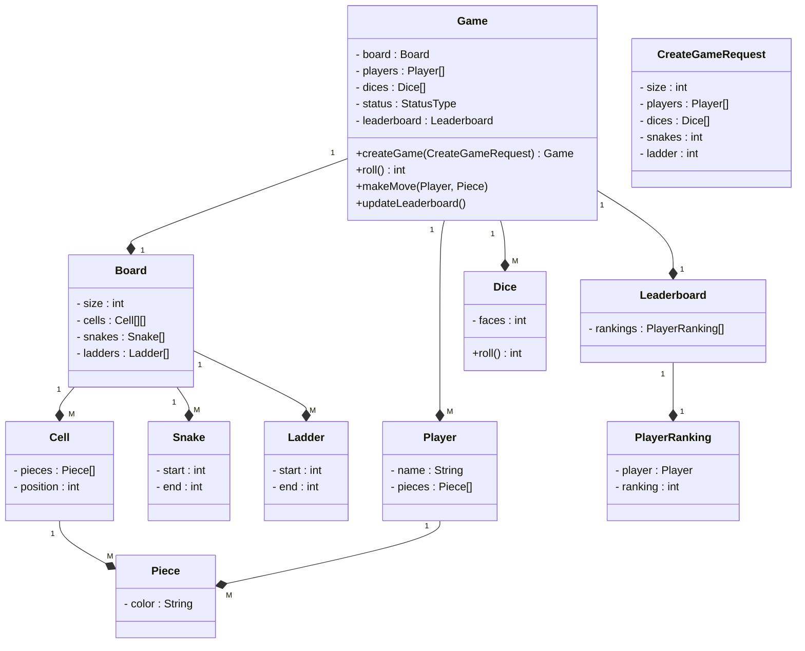
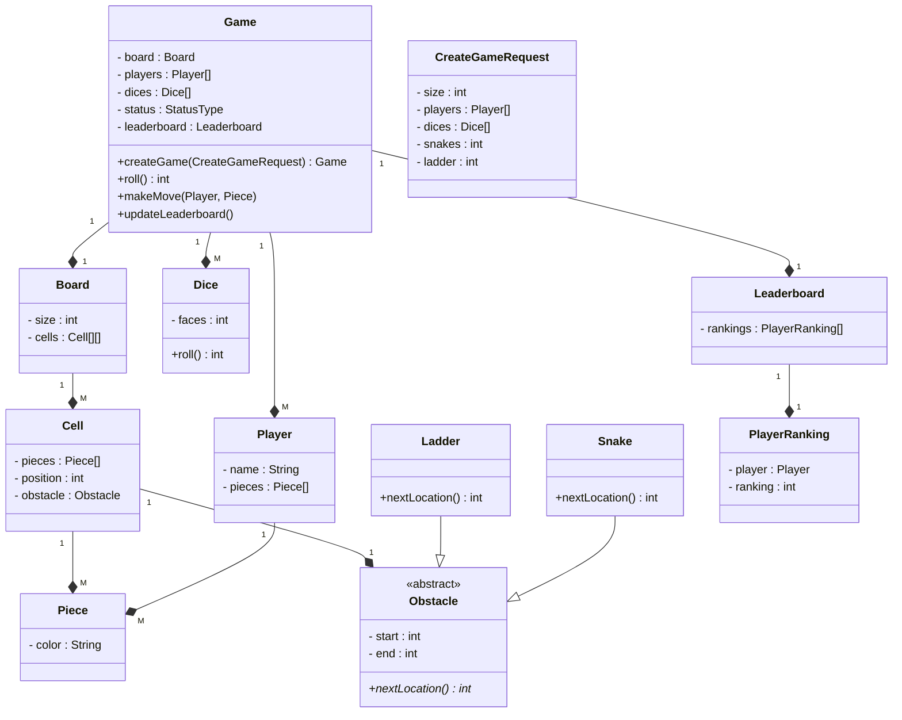
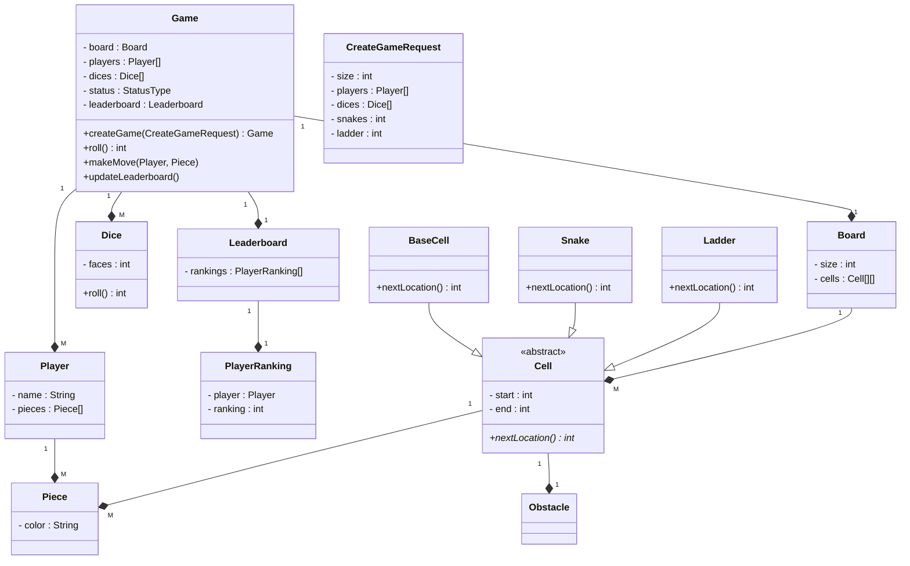

### Requirements
<hr>

1. A game can be between multiple players
2. A game will have only human player
3. Each player can have multiple pieces
4. A board can be of any varying size decided by client
5. A board will have different types of cells
6. There can be normal cells, cells with snakes, ladder
7. Position of snakes and ladders is random and decided at the start of the game
8. Number of snakes and ladders is random and decided at the start of the game
9. Size of snakes and ladders is random and decided at the start of the game
10. A player will move on the basis of dice
11. A player will enter the game only if they get 1 or max value of the dice
12. A player will win if they reach the last cell
13. A game will end when all players except one reach the last cell
14. A game will have leaderboard which has ranking of each player


### Class Diagram V1
<hr>



### Note:
* The following violates OCP when we want to add new kind of obstacle:
```
class Board {
  - size : int
  - cells : Cell[][]
  - snakes : Snake[]
  - ladders : Ladder[]
  }
```
* No parent class for special cells - Code duplication:
```
  class Snake {
  - start : int
  - end : int
  }
  class Ladder {
  - start : int
  - end : int
  }
```


### Class Diagram V2
<hr>


### Note:

* Add obstacle abstract class to unify ladder, snake 
* Move obstacle in cell
* Might have to add null checks : Not all cells have obstacles

### Class Diagram V3 : Optimisation for null checks for obstacles in a cell (Adding an empty cell to obstacle hierarchy)
<hr>


### Note:
* This solution is hacky even if you don't come up with no problem