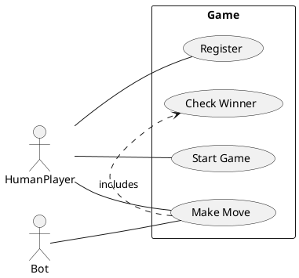
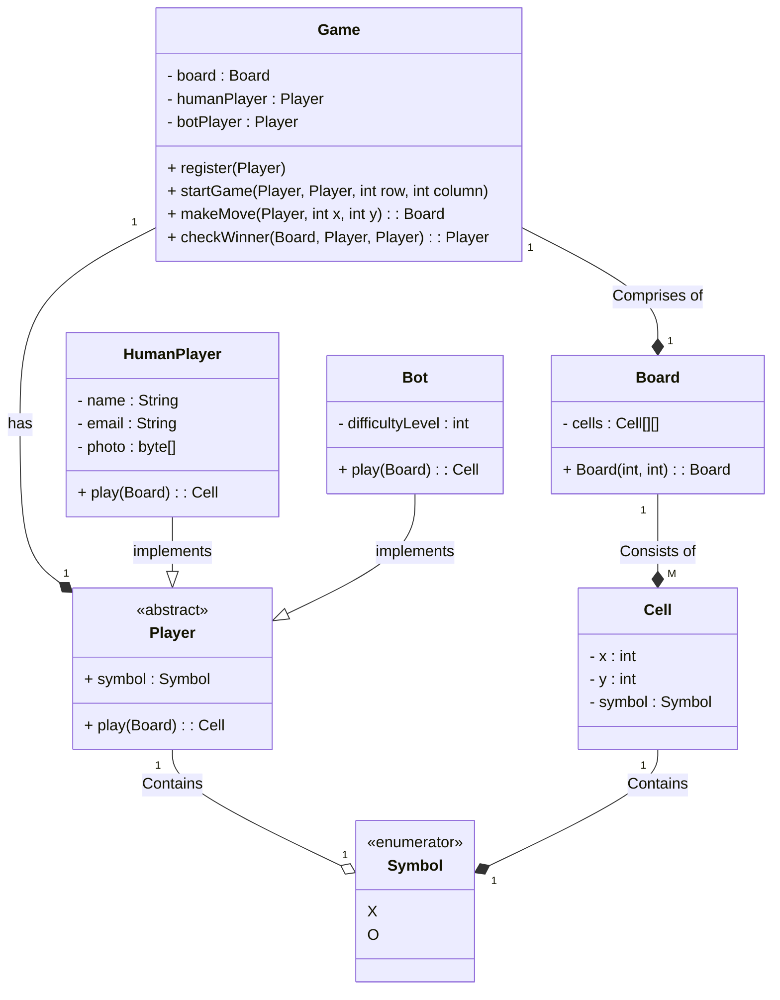

## Design TicTacToe

### Requirements

1. Board can be of NxN size
2. There can be 2 players
3. Each player will be allotted a symbol
4. The symbol can be O and X
5. The players can be humans or bots
6. Each human player will have name, email, profile image
7. Each bot player will have a difficulty level
8. Any random player can start the game
9. Each the players will take turn alternatively
10. The player with N consecutive of their symbol in a row or column or diagonal wins
11. If board is full and no player wins then its draw

### Entities and attributes

1. Board
   1. Size
   2. Cell[][]
2. Player
   1. Symbol
   2. Type - Human, Bot
3. Symbol
4. Human Player
   1. Name
   2. Email
   3. Photo
5. Bot Player
   1. Difficulty level
6. Game
   1. Board
   2. Players
7. Cell
   1. X, Y
   2. Symbol

### Use Case Diagram

### Class Diagram
