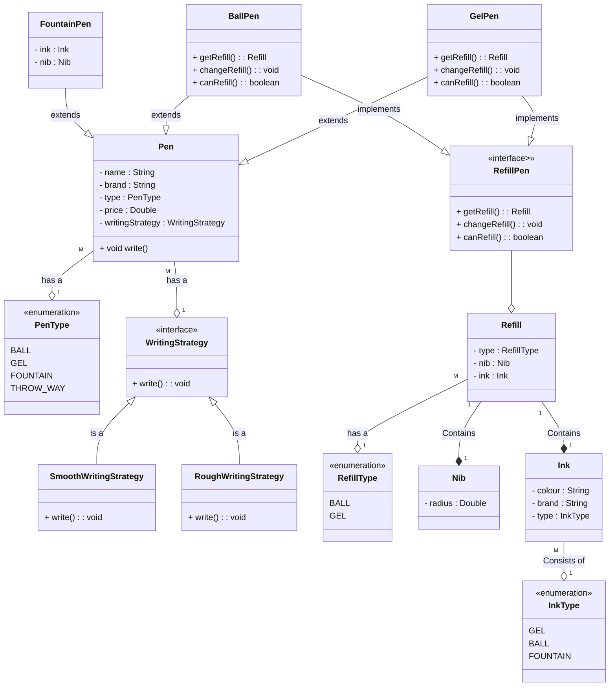

## Design a Pen

### Requirements

1. A pen is anything that can write
2. Pen can be Gel, Ball, Fountain, Marker, Throwaway 
3. Ball pen, gel pen have a Ball Pen Refill and Gel Pen refill respectively
4. A refill has a nib and an ink
5. Ink can be of different colour
6. A fountain pen has an ink
7. Refill has a radius. For fountain pen, its nib has a radius
8. Each pen can write in a different way
9. Some pens write in the same way
10. Every pen has a brand and a name
11. Some pens may allow refilling while others might not

### Entities and attributes

1. Pen
   1. Brand
   2. Name
   3. Price
   4. Type - Gel, Ball, Fountain, Marker, Throwaway
   5. Refillable (TBD)
2. Refill
   1. Type - Gel, Ball
   2. Ink
   3. Nib
   4. Refillable (TBD)
3. Ink
   1. Colour
   2. Brand
   3. Type - Gel, Ball, Fountain
4. Nib
   1. Radius
   2. Type - Gold, Silver, Plastic

### Different types of Pen

1. Gel pen
   1. Type - `Gel`
   2. Refillable - `Yes`
   3. Refill
      1. Type - `Gel`
      2. Refillable - `Yes`
   4. Ink
   5. Nib
   
2. Throwaway pen
    1. Type - `Throwaway`
    2. Refillable - `No`
    3. Refill
        1. Type - `Ball`
        2. Refillable - `No`
    4. Ink
    5. Nib
   
3. Fountain pen
    1. Type - `Fountain`
    2. Refillable - `Yes`
    3. Ink
    4. Nib

### Class Diagram:

### Note:
* Once we destroy a pen does it make sense it keep the instance of refill? Hence composition